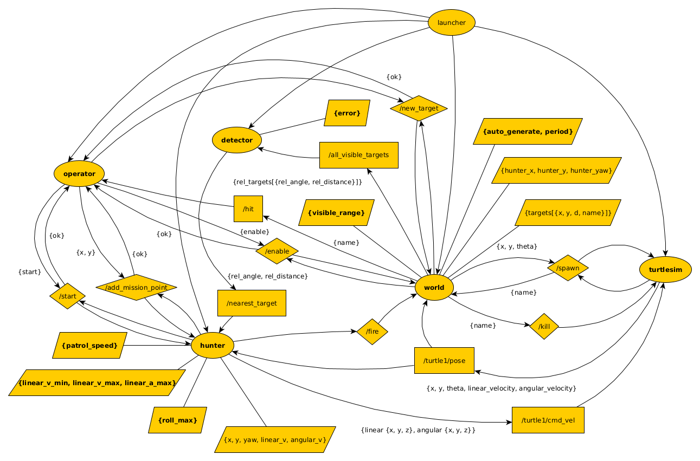

# Tutrle Hunt

ROS2 For Beginners - Course Project.

## Overview

The idea is to simulate a hunt system. The main turtle is a hunter and must find and catch all other turtles. But the hunter has a very limited view distance. Moreover, all other turtles appear outside the view range.  
So the main turtle has to patrol the area from point to point according to some plan. This movement plan is set by some high level operator.  
The turtle cyclically moves along the path. It accelerates and goes to the nearest turtle if any detected. The detection mechanism has some random error. When the target is near enough to the hunter it is considered to be caught and disappears from the field.  
If there is no other turtles in the visible range, the hunter returns to the basic movement plan.

## Repository Contents

* **src/turtle_hunt_py_pkg** - Package with the system nodes
* **src/custom_interfaces** - Package with custom interfaces used in the system
* **src/custom_bringup** - Launch package
* **doc/** - General project documentation files

## System architecture

The system consists of five nodes.  

You can view the architecture source `doc/turtle_hunt.graphml` file with [yEd](https://www.yworks.com/products/yed) graph editor.

* **turtlesim**

    Existing ROS2 node from the **turtlesim** package.

* **world**

    This node summons new targets and calculates relative positions of all targets.

* **detector**

    This node simulates the error in detecting targets and chooses the nearest one.

* **hunter**

    This node controls the main turtle movement by points in patrol mode. And if it receives any data from the detector it switches to the hunt mode and controls the hunter movement with proportional linear and angular velocity adjustment according to the relative target position.

* **operator**

    This node generates and loads the patrol points to the hunter and initiates the game itself. 

## ROS2 Setup

Compatible with Ubuntu 22.04 and ROS2 Humble Hawksbill. 

### Add Repository

    sudo apt install software-properties-common
    sudo add-apt-repository universe
    sudo apt update && sudo apt install curl -y
    sudo curl -sSL https://raw.githubusercontent.com/ros/rosdistro/master/ros.key -o /usr/share/keyrings/ros-archive-keyring.gpg
    echo "deb [arch=$(dpkg --print-architecture) signed-by=/usr/share/keyrings/ros-archive-keyring.gpg] http://packages.ros.org/ros2/ubuntu $(. /etc/os-release && echo $UBUNTU_CODENAME) main" | sudo tee /etc/apt/sources.list.d/ros2.list > /dev/null
    sudo apt update
    sudo apt upgrade
 
### Install ROS2 Humble Hawksbill

    sudo apt install ros-humble-desktop ros-dev-tools

### Add to ~/.bashrc

    # ROS
    source /opt/ros/humble/setup.bash
    source /usr/share/colcon_argcomplete/hook/colcon-argcomplete.bash

## Build

### Build all workspace packages
    colcon build

### Add executables to path
    source ./install/local_setup.bash

### Launch
    ros2 launch custom_bringup turtle_hunt.launch.py

You should see something similar to the video by the link below. 

